<h2>LED Matrix</h2>

<h3>Beschreibung</h3>

Es handelt sich hierbei um ein reines "Lernprojekt" ohne wirklichen Nutzen.
Ich dachte es wäre eine coole Sache mal eine etwas größere LED Matrix anzusteuern.
Ich habe mich dann für 12x14 (168 LEDs) entschieden. Da ich mit fertigen Multiplex
ICs (MAX7219) schon Erfahrung hatte, wollte ich es diesmal "von Hand" machen. Das
erhöht den Schaltungsaufwand zwar enorm, aber auch den Lerneffekt (das war z.B. das
erste Projekt bei dem ich <a href="http://de.wikipedia.org/wiki/MOSFET">MOSFETs</a>
benutzt habe).

Das Problem bei einer solchen Anzahl von LEDs ist, dass man im Allgemeinen nicht genug
Portpins am Mikrocontroller zur Verfügung hat, um jede einzeln anzusteuern. Daher verwendet
man ein <a href="http://de.wikipedia.org/wiki/Multiplexverfahren">Zeitmultiplexverfahren</a>.
D.h. es sind nicht wirklich alle LEDs eingeschaltet sondern
(in meinem Fall) immer nur eine "Spalte". Es wird dann so schnell zwischen den Spalten
umgeschaltet, dass aufgrund der Trägheit des menschlichen Auges, die Illusion von
Gleichzeitigkeit entsteht (ab ca. 60 Hz Bildaufbaufrequenz wird das Bild flimmerfrei).
Auf diese Weise reichen normalerweise für eine n\*m Matrix gerade einmal n+m Portpins
(in meinem Fall also 26, welche ich durch vier 8 Bit seriell nach parallel Wandler
("Schieberegister") realisiert habe). Mehr dazu
<a href="http://www.mikrocontroller.net/articles/LED-Matrix">hier</a>.

Leider kann man mit der kostenlosen Light-Version von Eagle keine Platinen in der Größe,
die ich hier gebraucht hätte, erstellen. Daher habe ich das ganze auf Lochraster aufgebaut.

<h3>Fotos</h3>

<a href="images/IMG_8068-1280.jpg">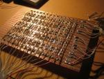</a>
<a href="images/IMG_8070-1280.jpg">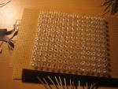</a>
<a href="images/IMG_8077-1280.jpg">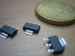</a>
<a href="images/IMG_8078-1280.jpg">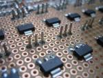</a>
<a href="images/IMG_8080-1280.jpg">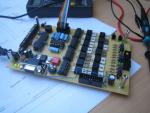</a>
<a href="images/IMG_8081-1280.jpg">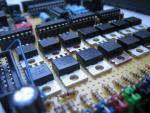</a>
<a href="images/IMG_8083-1280.jpg">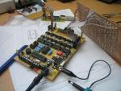</a>
<a href="images/IMG_8086-1280.jpg">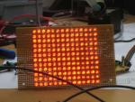</a>
<a href="images/IMG_8100-1280.jpg">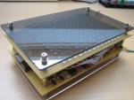</a>
<a href="images/IMG_8102-1280.jpg">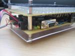</a>
<a href="images/IMG_8103-1280.jpg">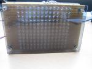</a>

<a href="images/IMG_8109-1280.jpg">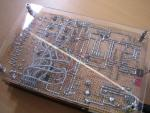</a>

<h3>Schaltplan</h3>

<a href="schematic.png">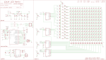</a>

<a href="multiplex.sch">Eagle .sch Datei</a>

(Da es sich bei den Zeilentransistoren um P-Kanal MOSFETs handelt, ist die Ansteuerung hier <b>invertiert</b>.
D.h. eine Zeile ist aktiv, wenn der entsprechende Schieberegister Pin auf <b>Low</b> Pegel liegt!)

<h3>Software</h3>

... ist ziemlich hässlich :-) Gibts vielleicht auf Anfrage per Mail :-)

