

  <a href="images/IMG_8379.JPG">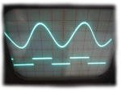</a>

<h2>Digitaler Funktionsgenerator</h2>

<h3>Beschreibung</h3>

Wieder einmal ein, abgesehen vom Lerneffekt, völlig nutzloses Projekt. Da ich durch glückliche Umstände
(Danke Alex!) kürzlich an ein altes <a href="http://de.wikipedia.org/wiki/Oszilloskop">Oszilloskop</a> gekommen bin,
brauchte ich natürlich eine Möglichkeit,
dieses auch etwas besser kennen zu lernen. Konstante 5V Gleichspannungen angucken ist auf Dauer recht langweilig,
also habe ich mir einen kleinen digitalen <a href="http://de.wikipedia.org/wiki/Funktionsgenerator">Funktionsgenerator</a>
gebaut. War ein interessantes Projekt. Auch wenn ich bezweifle, dass irgendjemand jemals diese Schaltung nachbauen und
meine Software benutzen wird, möchte ich sie trotzdem zur Verfügung stellen.

<h3>Features</h3>

<ul>
 <li>zwei <a href="http://de.wikipedia.org/wiki/Digital-Analog-Umsetzer">Digital/Analog Wandler</a> und ein
     <a href="http://de.wikipedia.org/wiki/Pulsweitenmodulation">PWM</a> Kanal als Ausgänge</li>
 <li>einstellbare Frequenz, Auflösung (bzw. Pulsweite) und Amplitude</li>
 <li><a href="http://de.wikipedia.org/wiki/Tiefpass">Tiefpassfilter</a> mit einstellbaren Grenzfrequenzen und
     <a href="http://de.wikipedia.org/wiki/Operationsverst%C3%A4rker">nicht-invertierende Verstärker (OpAmps)</a> für jeden Ausgang</li>
 <li>ein "externer Kanal" auf einen vierten Tiefpass+OpAmp geführt</li>
 <li>Verstärkung bis auf Netzteilspannung (nicht nur auf Logik-Level!) möglich</li>
 <li>Sinus, Rechteck, Dreieck und Sägezahn in Software implementiert</li>
</ul>

TODO:
<ul>
 <li>Software: Irgendwas schönes (<a href="http://www.youtube.com/watch?v=s1eNjUgaB-g">sowas</a> z.B.) mit dem X/Y Mode vom Oszi basteln</li>
 <li>Hardware: Offset Korrektur für OpAmp und auch negative Spannungen möglich machen</li>
</ul>

<h3>Fotos</h3>

Platine:
<blockquote>

<a href="images/IMG_8375.JPG">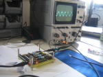</a>
<a href="images/IMG_8376.JPG">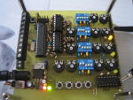</a>
<a href="images/IMG_8400.JPG">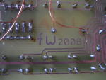</a>
<a href="images/IMG_8402.JPG">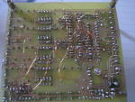</a>

</blockquote>

Rechteck (ungefiltert und gefiltert):
<blockquote>

<a href="images/IMG_8381.JPG">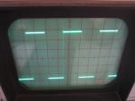</a>
<a href="images/IMG_8383.JPG">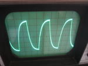</a>
<a href="images/IMG_8384.JPG">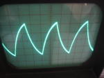</a>

</blockquote>

Dreieck (mit verschiedenen Auflösungen des Digital/Analog-Wandlers):
<blockquote>

<a href="images/IMG_8386.JPG">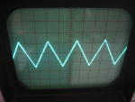</a>
<a href="images/IMG_8387.JPG">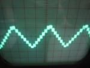</a>
<a href="images/IMG_8389.JPG">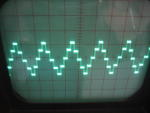</a>

</blockquote>

Sägezahn (ungefiltert und geglättet):
<blockquote>

<a href="images/IMG_8390.JPG">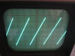</a>
<a href="images/IMG_8391.JPG">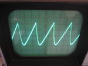</a>
<a href="images/IMG_8392.JPG">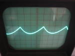</a>

</blockquote>

Sinus (verschiedene Auflösungen):
<blockquote>

<a href="images/IMG_8393.JPG">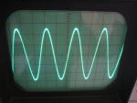</a>
<a href="images/IMG_8394.JPG">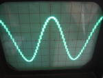</a>
<a href="images/IMG_8395.JPG">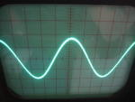</a>

</blockquote>

Überlagerung von Signalen:
<blockquote>

<a href="images/IMG_8396.JPG">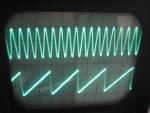</a>
<a href="images/IMG_8397.JPG">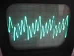</a>
<a href="images/IMG_8398.JPG">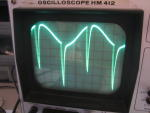</a>
<a href="images/IMG_8399.JPG">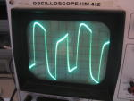</a>

</blockquote>

Sinus übersteuert (d.h. die Spannung hat die Versorgungsspannung des OpAmp erreicht):
<blockquote>

<a href="images/IMG_8408_w.JPG">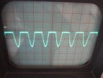</a>

</blockquote>

<h3>Schaltplan</h3>

<blockquote>

<a href="images/scope_sch.png">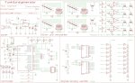</a>
<a href="images/scope_board.png">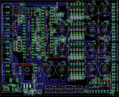</a>
<a href="images/scope_cg_top.jpg">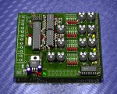</a>
<a href="images/scope_cg_bottom.jpg">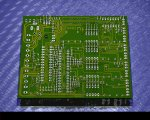</a>

</blockquote>

Eagle files:
<ul>
 <li><a href="scope.sch">Schematic</a></li>
 <li><a href="scope.brd">Board Layout</a></li>
</ul>

Mit dem Board Layout bin ich alles andere als zufrieden. Leider sind noch einige "fliegende Verbindungen" drin, hatte irgendwann keine Lust
mehr neu anzufangen, als ich gemerkt habe, dass es eng wird :-)

<h3>Software</h3>

<ul>
 <li><a href="src">v1: C Quelltext und vorkompilierte .hex Datei</a></li>
</ul>

(Ich benutze in diesem Projekt "<a href="http://www.sics.se/~adam/pt/">Protothreads</a>", eine schlanke
Multithreading Implementation von Adam Dunkels)
