<h2>RTTTL Player</h2>

<h3>Beschreibung</h3>

<a href="http://de.wikipedia.org/wiki/RTTTL">RTTTL</a> steht für
<i>Ringing Tones Text Transfer Language</i> und ist ein relativ altes
und primitives, von Nokia entwickeltes, Dateiformat f&uuml;r kurze Musik
Melodien, in erster Linie Handy Klingelt&ouml;ne.

Motiviert durch ein Geburtstagsgeschenk, dass eine "Happy Birthday"-Melodie
piepsen sollte, habe ich vor einiger Zeit dieses Klingeltonformat für den
Atmel Mikrocontroller implementiert. Damit ist es möglich auf einem Atmel
mit einem gewöhnlichen Buzzer oder anderem Lautsprecher, sehr einfach
Musik abzuspielen. Die Melodien haben diverse Einschränkungen (z.B.
kann immer nur ein Ton gleichzeitig gespielt werden, d.h. keine Akkorde, etc.),
dafür ist das Format aber sehr kompakt. So ist es etwa möglich zehn
Weihnachtslieder in nur knapp 2 Kilobyte Flash Speicher unterzubringen.

Benutzt habe ich das ganze wie gesagt für ein Geburtstagsgeschenk für meine
Cousine, die damals 22 Jahre alt wurde und für einen Weihnachtsstern
(siehe Videos). Der "22-Piepser" war übrigens meine erste selbst
geätzte Platine (Tonertransfermethode).

<h3>Fotos</h3>

Weihnachtsstern:
<blockquote>

<a href="images/IMG_8468.jpg">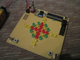</a>
<a href="images/IMG_8470.jpg">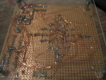</a>

</blockquote>

22:
<blockquote>

<a href="images/IMG_8403.JPG">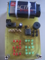</a>
<a href="images/IMG_8404.JPG">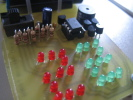</a>
<a href="images/IMG_8405.JPG">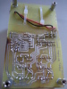</a>
<a href="images/IMG_8406.JPG">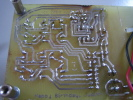</a>

</blockquote>

22 &auml;tzen:
<blockquote>

<a href="images/IMG_7901.JPG">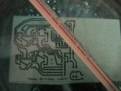</a>
<a href="images/IMG_7907.JPG">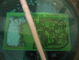</a>
<a href="images/IMG_7913.JPG">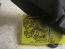</a>
<a href="images/IMG_7915.JPG">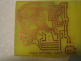</a>

</blockquote>

<h3>Schaltpl&auml;ne</h3>

22:
<blockquote>

<a href="images/judith.png">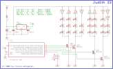</a>

</blockquote>

Weihnachtsstern:
<blockquote>

<a href="images/tante.png">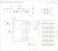</a>

</blockquote>

<h3>Software</h3>

Die Software besteht aus zwei Teilen. Ein kleines Perl Skript, dass
die RTTTL Klingelt&ouml;ne in ein noch platzsparenderes Bin&auml;rformat
umwandelt und den Interpreter, der auf dem Mikrocontroller ausgef&uuml;hrt
wird und auf diesem das Bin&auml;rformat interpretiert und den Lautsprecher
entsprechend anspricht.

Ich bin mir fast sicher, dass in der Software noch diverse Bugs vorhanden sind.
Das ganze war mehr ein "Quick and Dirty" Projekt. F&uuml;r mich hat es aber
gut funktioniert. Getestet habe ich auf einem Atmel ATMega 88 und auf einem
ATTiny 45 Mikrocontroller. Es sollte die gcc Compileroption "-Os" aktiviert
sein und keine weitere Optimierung, da sonst eventuell von mir benutzte
Festkommaoperationen (die Atmels haben keine
<a href="http://de.wikipedia.org/wiki/FPU">FPU</a>!) "wegoptimiert" werden
(keine Ahnung warum, ist mir aber schon passiert!). Falls trotzdem
Probleme auftreten (man hört nichts oder nur sehr kurze abgehackte Töne),
dann sollte man versuchen die Festkommaoperationen durch Gleitkommaoperationen
zu ersetzen (das wird die Codegröße aber vermutlich um mehrere Kilobyte (!!!)
erhöhen, da die komplette Gleitkommaarithmetik per Software vom Compiler
emuliert werden muss!).

Download:
<ul>
 <li><a href="src/rtttl.c.txt">rtttl.c</a> (Interpreter)</li>
 <li><a href="src/rtttl2bin.pl.txt">rtttl2bin.pl</a> (Konverter mit Beispiel Musik)</li>
 <li><a href="src/rtttl_data.h.txt">rtttl_data.h</a> (Beispiel Output)</li>
</ul>

Output:
<blockquote>
<pre>
$ perl rtttl2hex.pl

 Generating frequency tables ...

 Generating 15 melodies...
 * Jingle Bells (254 byte)
 * Silent Nights (155 byte)
 * Alle Jahre wieder (202 byte)
 * Ihr Kinderlein kommet (162 byte)
 * Little Drummer Boy (161 byte)
 * We wish you a merry christmas (165 byte)
 * Oh Tannenbaum (174 byte)
 * Kling Gloeckchen (98 byte)
 * Oh du Froehliche (70 byte)
 * Schneefloecken Weissroeckchen (39 byte)
 * Morgen kommt der Weihnachtsmann (75 byte)
 * Leise rieselt der Schnee (73 byte)
 * Lasst uns froh und munter sein (180 byte)
 * Wie schoen, dass du geboren bist (415 byte)
 * Happy Birthday (40 byte)

 (Total sound data: 2264 bytes)

 Data saved to rtttl_data.h

</pre>
</blockquote>

<h3>Tools</h3>

Es gibt im Internet ein paar nette Tools um MIDI Files in RTTTL Klingeltöne
zu konvertieren, was sehr praktisch ist, da man MIDI Files wie Sand man Meer
findet (im Gegensatz zu Klingeltönen in diesem Dateiformat). Man muss
allerdings beachten, dass nur <b>einspurige</b> Midi Files benutzt werden
können und immer nur <b>ein Ton gleichzeitig</b> (keine Dreiklänge, Akkorde,
etc.) auftreten! Dafür gibt es aber kostenlos MIDI Editoren, um sowas in den
Griff zu bekommen.

Links:
<ul>
 <li><a href="http://www.codingworkshop.com/ringtones/index.html">
	Coding Workshop Ringtone Converter</a></li>
 <li><a href="http://midi.mathewvp.com/midi2RTTL.php">
	Online MIDI to RTTTL Converter</a></li>
 <li><a href="http://anvil-studio.softonic.de/">Anvil Studio Midi Editor</a></li>
</ul>

