<h2>Selfmade Stackmat Display</h2>

<h3>What's it all about?</h3>

I am a <a href="http://en.wikipedia.org/wiki/Speedcuber">Speedcuber</a>, that means I solve
Rubiks Cubes for speed. I don't like this thing very much, but the
<a href="http://www.speedstacks.com/">Speed Stacks Stackmat Timer</a> has become the official
timing device in the speedcubing community. Speed Stacks also offers a official
"Stackmat Competition Display", a big external display extension for the timer so that
at competitions, the audience can see the times of the competitor. Unfortunately,
this display costs about 100 dollars. Beeing a poor student, this was way too much
for me.

So I decided to build one on my own (which can be rebuilt for about 25 to 40 dollars). 
Here I will present my results. I am sure you will like it! Feel free to tell me what
you think (flo at hackvalue dot de).

This is just a small documentation, <b>not</b> a tutorial! I am not going to explain
every little detail about how to rebuild it. If you are really interested, read up about
some electronics stuff and feel free to ask me by mail. It is not that hard, even it looks
very complicated to a beginner, I know. If many people are interested, maybe I will create
a FAQ.

<h3>Video and Pictures</h3>

Video:  
<object type="application/x-shockwave-flash" width="425" height="350" data="http://www.youtube.com/v/Fj_J42mBATY">
<param name="movie" value="http://www.youtube.com/v/m_Dxp5HQNIA" />
</object>

Final pictures:
<blockquote>

<a href="images/final/IMG_8008.jpg">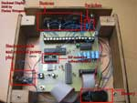</a>
<a href="images/final/IMG_8009.jpg">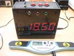</a>
<a href="images/final/IMG_8010.jpg">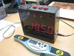</a>
<a href="images/final/IMG_8011.jpg">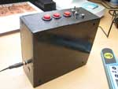</a>

</blockquote>

PCB pictures:
<blockquote>

<a href="images/WIP/pcb/IMG_7866.jpg">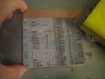</a>
<a href="images/WIP/pcb/IMG_7877.jpg">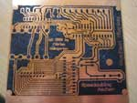</a>
<a href="images/WIP/pcb/IMG_7891.jpg">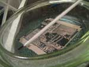</a>
<a href="images/WIP/pcb/IMG_7898.jpg">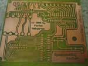</a>
<a href="images/WIP/pcb/IMG_7938.jpg">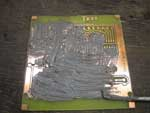</a> 
<a href="images/WIP/pcb/IMG_7939.jpg">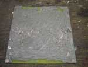</a>
<a href="images/WIP/pcb/IMG_7940.jpg">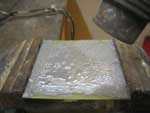</a>
<a href="images/WIP/pcb/IMG_7941.jpg">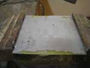</a>
<a href="images/WIP/pcb/IMG_7955.jpg">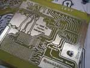</a>
<a href="images/WIP/pcb/IMG_7959.jpg">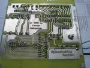</a>

</blockquote>

Case pictures:
<blockquote>

<a href="images/WIP/case/IMG_7981.jpg">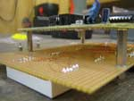</a>
<a href="images/WIP/case/IMG_7983.jpg">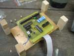</a>
<a href="images/WIP/case/IMG_7984.jpg">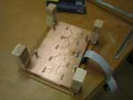</a>

<a href="images/WIP/case/IMG_7991.jpg">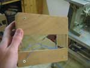</a> 
<a href="images/WIP/case/IMG_7994.jpg">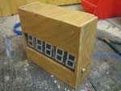</a>
<a href="images/WIP/case/IMG_7998.jpg">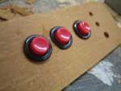</a>
<a href="images/WIP/case/IMG_8001.jpg">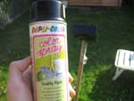</a>
<a href="images/WIP/case/IMG_8005.jpg">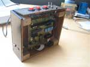</a>

</blockquote>

Other pictures:
<blockquote>

<a href="images/WIP/other/IMG_7932.jpg">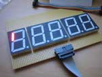</a>
<a href="images/WIP/other/IMG_7954.jpg">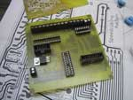</a>
<a href="images/WIP/other/IMG_7958.jpg">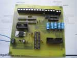</a>
 
<a href="images/WIP/other/IMG_7966.jpg">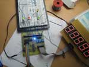</a>
<a href="images/WIP/other/IMG_7967.jpg">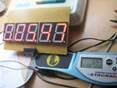</a>

</blockquote>

CG previews / design proposals:
<blockquote>

<a href="eagle/povray_up.jpg">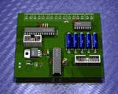</a>
<a href="eagle/povray_bottom.jpg">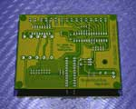</a>
<a href="images/cg/Image_1.jpg">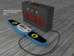</a>
<a href="images/cg/Image_2.jpg">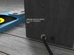</a>
<a href="images/cg/Image_3.jpg">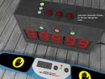</a>

</blockquote>

<h3>Features</h3>

It can ...
<ul>
 <li>... be connected to the stackmat timer to display the time, which is shown on the stackmat (in realtime, no delay)</li>
 <li>... run on an internal battery or a external power supply</li>
 <li>... calculate averages of saved times</li>
 <li>... display which hands (left, right, both, none) are on the stackmat timer</li>
</ul>

It can<b>not</b> ...
<ul>
 <li>... work without a stackmat (at least the software can't, the hardware could! Feel free to rewrite the software!)</li>
</ul>

What you will need to use it:
<ul>
 <li>Stackmat cable (3.5mm to 2.5mm (<a href="http://en.wikipedia.org/wiki/TRS_connector">TRS connector</a>) audio cable)</li>
 <li>9V block battery (or any other battery which gives something between 7V to 20V) or a extern power supply</li>
 <li>nothing else (especially no computer)</li>
</ul>

<h3>Schematics and board layout</h3>

I used <a href="http://www.cadsoft.de/download.htm">CadSoft Eagle</a> to design the schematic and board layout.

<ul>
 <li>Schematic (complete): <a href="eagle/stackmat.png">PNG</a></li>
 <li>Schematic (controller pcb): <a href="eagle/control.sch">Eagle file</a>, <a href="eagle/control_sch.png">PNG</a></li>
 <li>Board Layout (controller pcb): <a href="eagle/control.brd">Eagle file</a>, <a href="eagle/control_board.png">PNG</a>, <a href="eagle/control.pdf">PDF</a>, Eagle3D povray <a href="eagle/povray_up.jpg">top</a> / <a href="eagle/povray_bottom.jpg">bottom</a></li>
</ul>

The board layout file is my layout which I etched into a printed circuit board. This is not necessary,
you can also use a breadboard!)

<h3>How to build this thing?</h3>

You should be able to ...
<ul>
 <li>solder</li>
 <li>read a schematic</li>
 <li>understand some basic stuff about electronics</li>
</ul>

Things you will need:
<ul>
 <li>Atmel Atmega88 Microcontroller (<a href="datasheets/m88.pdf">datasheet</a>)</li>
 <li>Maxim MAX7219 Display controller (<a href="datasheets/max7219.pdf">datasheet</a>)</li>
 <li>Maxim MAX232 Level shifter (<a href="datasheets/max232.pdf">datasheet</a>)</li>
 <li>7805 voltage regulator (<a href="datasheets/7805.pdf">datasheet</a>)</li>
 <li>six 100 nF ceramic capacitors</li>
 <li>one 47 µF electrolytic capacitor</li>
 <li>five 1 µF electrolytic capactors</li>
 <li>three 10 k&Omega; resistors</li>
 <li>five LEDs (power, case light, three stackmat status LEDs)</li>
 <li>resistors for the five LEDs (value depends on the LEDs! Look at the datasheet!)</li>
 <li>optionally an ISP socket for easier software updates</li>
 <li>some kind of Atmel ISP programmer for getting the software onto the Atmel Microcontroller (don't buy a programmer from Atmel! They are
     very expensive. There are many cheap or easy to build ISP programmers)</li>
 <li>five 7-segment LED displays <b>with common cathode</b> (<b>not</b> common anode!)</li>
 <li>two diodes</li>
 <li>one two-state stereo switch for power selection, one two-state mono switch</li>
 <li>three buttons</li>
</ul>

Details / possible mistakes:
<ul>
 <li>connect <b>all</b> ground (GND) pins</li>
 <li>the pin positions of the ICs in the schematic vary from the "real" positions. Have a look at the datasheets!</li>
 <li>ceramic capacitors have no polarity, <b>but electrolytic ones do</b>! That means it is important how you arrange them (thats what the "+" sign in the schematic is for), otherwise the capacitor could literally explode!</li>
</ul>

<h3>Software</h3>

Downloads:
<ul>
 <li><a href="src">source code and precompiled .hex file (version 0.1)</a></li>
</ul>

TODO:
<ul>
 <li>Power safe mode (display auto off if stackmat is removed / turned off or if it's idle), ...</li>
</ul>

<h3>How does it work?</h3>

<a href="images/scope.jpg">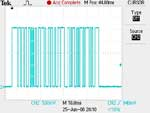</a>

The "stackmat signal" is essentially just a <a href="http://en.wikipedia.org/wiki/RS-232">RS232 serial signal</a>
(1200 baud, 8 databits, no parity bits, one stop bit). This signal is converted
to TTL level (5V/0V) by the MAX232 level shifter IC, so the Atmel
microprocessor can understand it.

The payload is transmitted in 9 byte packets:
<ul>
 <li>1: command byte as ASCII character ('I','A','S','L','R','C' or ' ')</li>
 <li>2-6: time in ASCII chars (2:34:56)</li>
 <li>7: checksum (64 + sum of time digits)</li>
 <li>8: CR (carriage return, ASCII code 0x0D)</li>
 <li>9: LF (line feed, ASCII code 0x0A)</li>
</ul>

Example:
<ul>
 <li>S02527P[CR][LF]</li>
 <li>time: 0:25:27</li>
 <li>checksum: 64 + 0 + 2 + 5 + 2 + 7 = 64 + 16 = 80 = 'P' (chechsuk OK)</li>
</ul>

Command bytes:
<ul>
 <li>'I': timer initialized and reset to 0 (both hand pads open)</li>
 <li>'A': timer ready to begin, both hand-pads covered</li>
 <li>' ': timer running/counting (both hand-pads open)</li>
 <li>'S': timing complete (both hand-pads open)</li>
 <li>'L': left hand-pad covered (overrides 'I', ' ', 'S')</li>
 <li>'R': right hand-pad covered (overrides 'I', ' ', 'S')</li>
 <li>'C': both hand-pads covered (overrides 'I', ' ', 'S')</li>
</ul>

<h3>Thanks to ...</h3>

<ul>
 <li>... <a href="http://lochraster.org/">Alexander 'fd0' Neumann</a> for encouraging me,
     getting me started with microcontroller programming and for helping me
     <a href="images/scope.jpg">reverse engineer the stackmat signal</a>
     (I do not own an oscilloscope :-))</li>
 <li>... <a href="http://www.toomuchtimeonyourhands.co.uk/">Matt 'floater81' Burns</a> for his open source java stackmat display</li>
 <li>... the <a href="http://www.worldcubeassociation.org/">World Cube Association</a> for organizing all this great speedcubing events around the world</li>
 <li>... <a href="http://lkdesigns.de/">Lukas Kalkhoff</a>, for creating the <a href="images/cg">CG design proposals in Cinema 4D</a></li>
</ul>

<h3>I have questions!</h3>

Feel free to ask me by mail (flo at hackvalue dot de).

