

 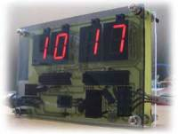

<h2>DCF77 Funkuhr</h2>

Mein erstes "gr&ouml;&szlig;eres" Mikrocontroller Projekt war eine <a href="http://de.wikipedia.org/wiki/DCF77">Funkuhr</a>
(eines der typischen Anf&auml;ngerprojekte), die ich auf einer Lochraster Platine aufgebaut und meinem Vater zum Geburtstag
geschenkt habe.

Da ich damals damit gerechnet habe, dass ich garantiert eines der Empfangsmodule f&uuml;r das Funksignal beim
basteln kaputt mache, habe ich vorsichtshalber zwei bestellt. Da keins kaputt gegangen ist brauchte ich
eine Verwendung f&uuml;r das zus&auml;tzliche Modul, also habe ich noch eine Uhr gebaut, diesmal mit eigener Platine.

<h3>Bilder</h3>

<a href="images/IMG_8027.jpg">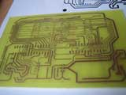</a>
<a href="images/IMG_8038.jpg">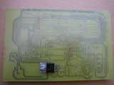</a>
<a href="images/IMG_8046.jpg">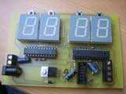</a>
<a href="images/IMG_8048.jpg">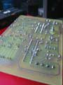</a>
<a href="images/IMG_8054.jpg">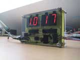</a>
<a href="images/IMG_8055.jpg">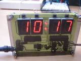</a>
<a href="images/IMG_8056.jpg">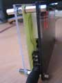</a>
<a href="images/IMG_8057.jpg">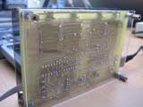</a>
<a href="images/IMG_8058.jpg">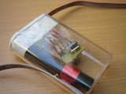</a>
<a href="images/uhr_cg_top.jpg">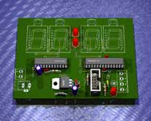</a>
<a href="images/uhr_cg_bottom.jpg">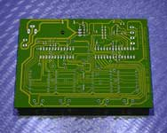</a>

<h3>Schaltplan</h3>

 <a href="images/uhr_sch.png">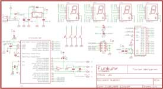</a>
 <a href="images/uhr_brd.png">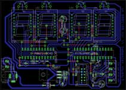</a>
 <a href="images/uhr_aetzvorlage.png">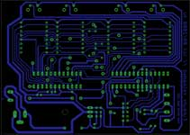</a>
 

Eagle Dateien:
<ul>
 <li><a href="uhr.sch">Schematic</a></li>
 <li><a href="uhr.brd">Board Layout</a></li>
</ul>

Ben&ouml;tigte Bauteile:
<blockquote>

<a href="images/IMG_8062.jpg">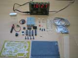</a>

</blockquote>

Das DCF77 Modul gibt es bei Reichelt und hin und wieder etwas g&uuml;nstiger auch bei Pollin. Die Plexiglas Scheiben
habe ich aus einem Hornbach Baumarkt. Die Restlichen Bauteile sind alle von Reichelt.

<h3>Software</h3>
Die Software ist in C geschrieben und kann frei verwendet werden (unter den Bedingungen der <a href="http://de.wikipedia.org/wiki/GPL">GPL</a>).

<ul>
 <li><a href="src">Version 1: Quelltext und vorkompilierte .hex Datei</a></li>
</ul>

